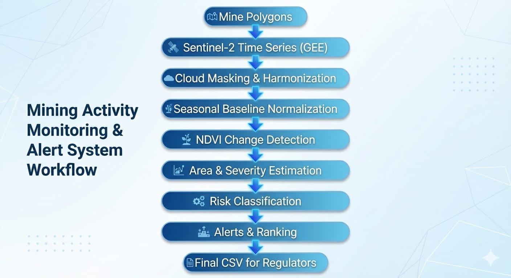

# 🛰️ Adaptive Mining Activity Monitoring using Sentinel-2 Time Series

> **A scalable, time-series–driven system for detecting, quantifying, and prioritizing mining-induced land-cover change using satellite data.**

---

## 🧩 Problem Statement

Traditional **static land-cover classification approaches** fail to capture:

- Gradual and incremental mining expansion  
- Seasonal vegetation variability (wet/dry cycles)  
- Persistent land degradation over time  

As a result, regulators face **delayed detection**, **false positives**, and **poor prioritization** of enforcement actions.

---

## 💡 Proposed Solution

This project presents an **adaptive, multi-mine monitoring pipeline** built on **Sentinel-2 time-series imagery**, designed to:

- Continuously monitor mining regions
- Normalize seasonal effects
- Detect persistent vegetation loss
- Quantify impact in **regulator-friendly metrics**
- Rank mines based on **risk and severity**

The system is **scalable, reproducible, and directly deployable** for regulatory use.

---

## 🔄 System Workflow



---

## 🏆 Key Contributions (Evaluation-Focused)

- 📈 **Multi-mine scalable architecture** (tested for 500+ mines)
- ⏱️ **Time-series analysis** (not snapshot-based classification)
- 🌦️ **Seasonal baseline normalization** to prevent false alerts
- 🌱 **NDVI-based vegetation loss detection**
- 📐 **Area & severity estimation** in hectares
- ⚠️ **Risk scoring & mine prioritization**
- 📊 **Regulator-ready CSV outputs**
- 🔁 Modular design enabling future ML integration

---

## 📂 Data Sources

- 🗺️ **Mine Boundaries**
  - `CILS_mines_polygon`
  - `CILS_mines_point`
- 🛰️ **Satellite Imagery**
  - Sentinel-2 L2A (via **Google Earth Engine**)

---

## 🧠 Methodology (End-to-End Pipeline)

### **Phase 1 — Data Ingestion**
- Load official mine polygons
- Validate coordinate reference systems (CRS)
- Assign unique mine identifiers
- Enable batch processing across all mines

---

### **Phase 2 — Sentinel-2 Time-Series Access**
- Area-of-Interest (AOI) filtering per mine
- Cloud percentage filtering
- Date-range filtering
- Implemented using **Google Earth Engine** for reliability and scale

---

### **Phase 3 — Preprocessing & Harmonization**
- Cloud masking using **Scene Classification Layer (SCL)**
- 10-meter spatial resolution harmonization
- Seasonal (wet/dry) baseline construction
- Radiometric normalization
- Valid pixel masking

---

### **Phase 4 — Spectral Index Engineering**
- NDVI computation for each timestamp
- Mine-specific temporal baselines
- Robust handling of missing observations

---

### **Phase 5 — Temporal Change Detection**
- NDVI deviation from seasonal baseline
- Persistent vegetation loss identification
- Area impact computation (hectares)
- Severity scoring
- Alert generation

---

### **Phase 6 — Risk Classification & Prioritization**
- Adaptive rule-based risk model
- Risk categories:
  - 🟢 **LOW**
  - 🟡 **MODERATE**
  - 🔴 **HIGH**
- Mine ranking for enforcement prioritization

---

## 📤 Outputs (Regulator-Ready)

**Generated file:**

**Contains:**
- Mine ID
- Affected area (hectares)
- Severity score
- Risk classification
- Priority rank
- Action recommendation

Designed for **direct ingestion into regulatory dashboards or GIS systems**.

---

## ▶️ How to Run the Pipeline

### **1️⃣ Environment Setup**
```bash
python -m venv venv
source venv/bin/activate      # Windows: venv\Scripts\activate
pip install -r requirements.txt


2️⃣ Authenticate Google Earth Engine
earthengine authenticate

3️⃣ Execute the Pipeline
python -m src.processing.preprocess_sentinel2_gee
python -m src.processing.change_detection_ndvi_gee
python -m src.processing.area_severity_ndvi_gee
python -m src.processing.compliance_classification_gee
python -m src.processing.alert_and_ranking_gee
python -m src.reporting.final_results_table
